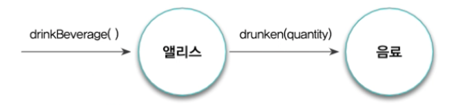

# 02. 이상한 나라의 객체

## 객체지향과 인지 능력

인간은 본능적으로 세상을 독립적이고 식별 가능한 객체의 집합으로 바라봅니다.
많은 사람들이 객체지향을 직관적이고 이해하기 쉬운 패러다임이라고 말하는 이유는 객체지향이 세상을 자율적이고 독립적인 객체들로 분해할 수 있는 인간의 기본적인 인지 능력에 기반을 두고 있기 때문입니다.

객체는 물리적인 경계를 지닌 구체적인 사물을 넘어 개념적으로 경계 지을 수 있는 추상적인 사물까지도 객체로 인식할 수 있게 합니다. 

객체지향 패러다임은 인간이 인지할 수 있는 다양한 객체들이 모여 현실 세계를 이루는 것처럼 소프트웨어의 세계 역시 인간이 인지할 수 있는 다양한 소프트웨어 객체들이 모여 이뤄져 있다고 생각합니다.

실행 중인 객체지향 애플리케이션의 내부를 들여다볼 수 있다면 겉으로는 우리가 알고 있는 세계와 유사해 보이지만 본질적으로는 매우 이질적인 모습을 지닌 세계와 마주치게 될 것 입니다.


## 객체, 그리고 이상한 나라

### 이상한 나라의 앨리스

이상한 나라의 앨리스에는 앨리스가 문을 통과하기 위해 키가 작아지고 커지는 장면이 나옵니다.


### 앨리스 객체

앨리스가 하는 행동에 따라 앨리스의 상태가 변하게 됩니다.

앨리스의 상태를 결정하는 것은 행동이지만 행동의 결과를 결정하는 것은 상태입니다.

행동에 의해 앨리스의 상태가 변경되더라도 앨리스가 앨리스라는 사실은 변하지 않습니다.
앨리스는 상태 변경과 무관하게 유일한 존재로 식별 가능합니다.

앨리스의 특징을 요약하면 아래와 같습니다.

* 앨리스의 상태를 가지며 상태는 변경 가능합니다.
* 앨리스의 상태를 변경시키는 것은 앨리스의 행동입니다.
  * 행동의 결과는 상태에 의존적이며 상태를 이용해 서술할 수 있습니다.
  * 행동의 순서가 결과에 영향을 미칩니다.
* 앨리스는 어떤 상태에 있더라도 유일하게 식별 가능합니다.


## 객체, 그리고 소프트웨어 나라

하나의 개별적인 실체로 식별 가능한 물리적인 또는 개념적인 사물은 어떤 것이라도 객체가 될 수 있습니다.
인간의 인지 능력 안에서 개수를 셀 수 있고, 다른 사물과 구분할 수 있으며, 생성 시점을 알 수 있고, 독립적인 하나의 단위로 인식할 수 있는 모든 사물은 객체입니다.
객체를 **상태**, **행동**, **식별자**를 지닌 실체로 보는 것이 가장 효과적입니다.


### 상태

#### 왜 상태가 필요한가

일반적으로 과거에 발생한 행동의 이력을 통해 현재 발생한 행동의 결과를 판단하는 방식은 복잡하고 번거로우며 이해하기 어렵습니다. 
따라서 인간은 행동의 과정과 결과를 단순하게 기술하기 위해 상태라는 개념을 고안했습니다.

상태를 이용하면 과거의 모든 행동 이력을 설명하지 않고도 행동의 결과를 쉽게 예측하고 설명할 수 있습니다.


#### 상태와 프로퍼티

숫자, 문자열, 양, 속도, 시간, 날짜, 참/거짓과 같은 단순한 값들은 객체가 아닙니다.
단순한 값들은 그 자체로 독립적인 의미를 가지기보다는 다른 객체의 특성을 표현하는 데 사용됩니다.
비록 단순한 값은 객체가 아니지만 객체의 상태를 표현하기 위한 중요한 수단입니다.

때로는 단순한 값이 아니라 객체를 사용해 다른 객체의 상태를 표현해야 할 때가 있습니다.
예를 들어 엘리스가 현재 음료를 들고 있는 상태인지를 표현하고 싶다면 앨리스의 상태 일부를 음료라는 객체를 이용해 표현할 수 있습니다.

결론적으로 모든 객체의 상태는 단순한 값과 객체의 조합으로 표현할 수 있습니다.
이 때 객체의 상태를 구성하는 모든 특징을 통틀어 객체의 **프로퍼티**라고 합니다.
일반적으로 프로퍼티는 변경되지 않고 고정되기 때문에 정적이고 프로퍼티 값은 시간이 흐름에 따라 변경되기 때문에 동적입니다.

객체와 객체 사이의 의미 있는 연결을 **링크**라고 합니다.
객체의 링크를 통해서만 메세지를 주고받을 수 있습니다.

객체 간의 선으로 표현되는 링크와 달리 객체를 구성하는 단순한 값은 **속성** 이라고 합니다.
객체의 프로퍼티는 단순한 값인 속성과 다른 객체를 가리키는 링크라는 두 가지 종류의 조합으로 표현할 수 있습니다.

객체의 상태를 다음과 같이 정의합니다.

```
상태는 특정 시점에 객체가 가지고 있는 정보의 집합으로 객체의 구조적 특징을 표현합니다.
객체의 상태는 객체에 존재하는 정적인 프로퍼티와 동적인 프로퍼티 값으로 구성됩니다.
객체의 프로퍼티는 단순한 값과 다른 객체를 참조하는 링크로 구분할 수 있습니다.
```


객체는 자율적인 존재기 때문에 다른 객체의 상태에 직접적으로 접근할 수도, 상태를 변경할 수도 없습니다.


### 행동

#### 상태와 행동

객체의 상태는 저절로 변경되지 않습니다.
객체의 상태를 변경하는 것은 객체의 자발적인 행동뿐입니다.

객체의 행동에 의해 객체의 상태가 변경된다는 것은 행동이 **부수 효과** 를 초래한다는 것을 의미합니다.
예를 들어 앨리스가 케이크를 먹는 행위는 앨리스의 키를 작게 변화시키고 케이크의 양을 줄이는 부수 효과를 야기합니다.

상태와 행동 사이에는 다음과 같은 관계가 있습니다.

* 객체의 행동은 상태에 영향을 받습니다.
* 객체의 행동은 상태를 변경시킵니다.

이것은 상태라는 개념을 이용해 행동을 다음의 두 가지 관점에서 서술할 수 있음을 의미합니다.

* 상호작용이 현재의 상태에 어떤 방식으로 의존하는가
* 상호작용이 현재의 상태를 변경시키는가

앨리스를 예시로 들면 아래와 같이 서술할 수 있습니다.

* 앨리스의 키가 40센티미터 이하라면 문을 통과할 수 있습니다.
* 문을 통과한 후에 앨리스의 위치는 아름다운 정원으로 바뀌어야 합니다.


#### 협력과 행동

객체는 자신에게 주어진 책임을 완수하기 위해 다른 객체를 이용하고 다른 객체에게 서비스를 제공합니다.

객체가 다른 객체와 협력하는 유일한 방법은 다른 객체에게 요청을 보내는 것입니다.
요청을 수신한 객체는 요청을 처리하기 위해 적절한 방법에 따라 행동합니다.
따라서 객체의 행동은 객체가 협력에 참여할 수 있는 유일한 방법입니다.

객체의 행동으로 인해 발생하는 결과는 두 가지 관점에서 설명할 수 있습니다.
객체의 행동은 이 두 가지 관점의 부수효과를 명확하게 서술해야 합니다.

* 객체 자신의 상태 변경
* 행동 내에서 협력하는 다른 객체에 대한 메세지 전송

행동을 다음과 같이 정의합니다.

```
행동이란 외부의 요청 또는 수신된 메세지에 응답하기 위해 동작하고 반응하는 활동입니다.
행동의 결과로 객체는 자신의 상태를 변경하거나 다른 객체에게 메세지를 전달할 수 있습니다.
객체는 행동을 통해 다른 객체와의 협력에 참여하므로 행동은 외부에 가시적이어야 합니다.
```


#### 상태 캡슐화

현실 세계의 객체와 객체지향 세계의 객체 사이에는 중요한 차이점이 있습니다.
현실 속에서 앨리스는 스스로 음료를 마시는 능동적인 존재지만 음료는 스스로는 아무 것도 할 수 없는 수동적인 존재입니다.

그러나 객체지향의 세계에서 모든 객체는 자신의 상태를 스스로 관리하는 자율적인 존재입니다.
앨리스는 직접적으로 음료의 상태를 변경할 수 없습니다.

앨리스가 음료를 마시는 과정에서 이뤄지는 앨리스와 음료 사이의 협력 관계를 그림으로 표현하면 아래와 같습니다.



앨리스에게 전달되는 메세지는 `drinkBeverage()`이고 음료에게 전달되는 메세지는 `drunken(quantity)` 입니다.
두 메세지를 통해 앨리스의 키가 줄어들거나 음료의 양이 줄어든다는 상태 변경을 예상할 수 없습니다.

이것이 캡슐화가 의미하는 것입니다.
객체는 상태를 캡슐 안에 감춰둔 채 외부에 노출하지 않습니다.
객체가 외부에 노출하는 것은 행동뿐이며, 외부에서 객체에 접근할 수 있는 유일한 방법 역시 행동뿐입니다.

상태를 외부에 노출시키지 않고 행동을 경계로 캡슐화하는 것은 결과적으로 객체의 자율성을 높입니다.
자율적인 객체는 스스로 판단하고 스스로 결정하기 때문에 객체의 자율성이 높아질수록 객체의 지능도 높아집니다.
협력에 참여하는 객체들의 지능이 높아질수록 협력은 유연하고 간결해집니다.


### 식별자

객체가 식별 가능하다는 것은 객체를 서로 구별할 수 있는 특정한 프로퍼티가 객체 안에 존재한다는 것을 의미합니다.
이 프로퍼티를 **식별자**라고 합니다.

값과 객체의 가장 큰 차이점은 값은 식별자를 가지지 않지만 객체는 식별자를 가진다는 점입니다.
시스템을 설계할 때는 이런 단순한 값과 객체의 차이점을 명확하게 구분하고 명시적으로 표현하는 것이 매우 중요합니다.

상태를 이용해 두 값이 같은지 판단할 수 있는 성질을 **동등성(equality)** 이라고 합니다.

객체는 상태와 무관하게 두 객체를 동일하거나 다르다고 판단할 수 있는 프로퍼티를 가집니다.
두 객체의 상태가 다르더라도 식별자가 같다면 두 객체를 같은 객체로 판단할 수 있습니다.
이처럼 식별자를 기반으로 객체가 같은지를 판단할 수 있는 성질을 **동일성(identical)** 이라고 합니다,

객체와 값을 지칭하는 별도의 용어를 사용하기도 합니다.
**참조 객체**  또는 **엔티티**는 식별자를 지닌 전통적인 의미의 객체를 가리키는 용어입니다.
값 객체는 식별자를 가지지 않는 값을 가리키는 용어입니다.


지금까지 살펴본 객체의 특성을 요약하면 아래와 같습니다.

* 객체는 상태를 가지며 상태는 변경 가능합니다.
* 객체의 상태를 변경시키는 것은 객체의 행동입니다.
  * 행동의 결과는 상태에 의존적이며 상태를 이용해 서술할 수 있습니다.
  * 행동의 순서가 실행 결과에 영향을 미칩니다.
* 객체는 어떤 상태에 있더라도 유일하게 식별 가능합니다.


## 기계로서의 객체

객체의 상태를 조회하는 작업을 **쿼리(query)**라고 하고 객체의 상태를 변경하는 작업을 **명령(command)**라고 합니다.

Object-Oriented Software Construction에서 객체를 기계에 비유해서 설명합니다.


## 행동이 상태를 결정한다

객체지향에 갓 입문한 사람들이 가장 쉽게 빠지는 함정은 상태를 중심으로 객체를 바라보는 것입니다.
초보자들은 객체에 필요한 상태가 무엇인지를 결정하고 그 상태에 필요한 행동을 결정합니다.

상태를 먼저 결정하고 행동을 나중에 결정하는 방법은 아래와 같은 이유로 설계에 나쁜 영향을 끼칩니다.

* 상태를 먼저 결정할 경우 캡슐화에 저해됩니다.
  상태에 초점을 맞출 경우 상태가 객체 내부로 깔끔하게 캡슐화되지 못하고 공용 인터페이스에 그대로 노출되버릴 확률이 높아집니다.
* 객체를 협력자가 아닌 고립된 섬으로 만듭니다.
  상태를 먼저 고려하는 방식은 협력이라는 문맥에서 멀리 벗어난 채 객체를 설계하게 함으로써 자연스럽게 협력에 적합하지 못한 객체를 창조하게 됩니다.
* 객체의 재사용성이 저하됩니다.
  상태에 초점을 맞춘 객체는 다양한 협력에 참여하기 어렵기 때문에 재사용성이 저하될 수 밖에 없습니다.

