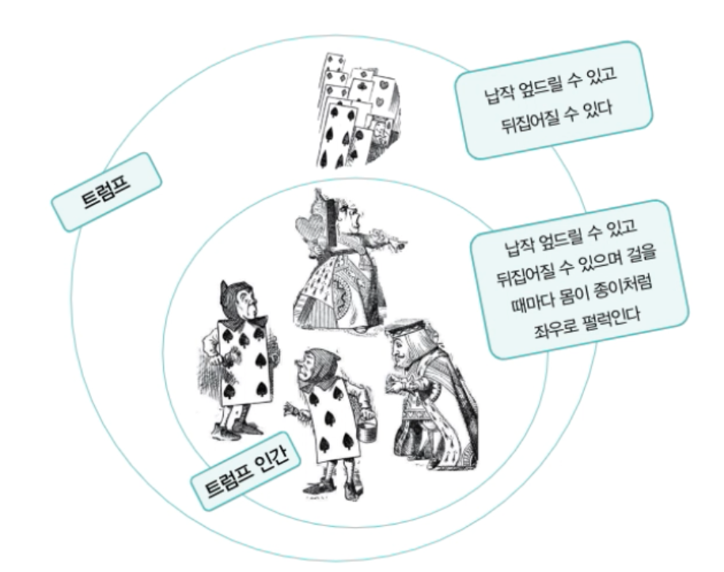
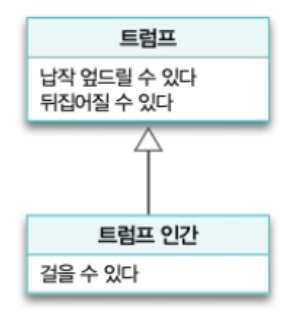

# 03. 타입과 추상화

지하철 노선도가 있기 때문에 복잡한 미로와 같이 지하철을 큰 어려움없이 이용할 수 있습니다.

초기의 지하철 노선도는 실제와 유사한 물리적인 지형 위에 구불구불한 운행 노선과 불규칙적인 역 간의 거리를 사실적으로 묘사했습니다.
이러한 사실적인 정보가 오히려 지하철을 이용하는 승객들로 하여금 노선도를 이해하기 어렵게 만들었습니다.

현재 사용중인 지하철 노선도는 정확성을 버리고 목적에 집중해 지하철 노선을 추상화한 결과 편리함을 제공할 수 있었습니다.


## 추상화를 통한 복잡성 극복

추상화의 목적은 불필요한 부분을 무시함으로써 현실에 존재하는 복작성을 극복하는 것입니다.
추상화는 복잡한 현실을 단순화하기 위해 사용하는 인간의 가장 기본적인 인지 수단이라고 할 수 있습니다.

어떤 추상화도 의도된 목적이 아닌 다른 목적으로 사용된다면 오도될 수 있습니다.
추상화의 수준, 이익, 가치는 목적에 의존적입니다.

추상화를 아래와 같이 정의할 수 있습니다.

```
어떤 양상, 세부 사항, 구조를 좀 더 명확하게 이해하기 위해 특정 절차나 물체를 의도적으로 생략하거나 감춤으로써 복잡도를 극복하는 방법입니다.
복잡성을 다루기 위해 추상화는 두 차원에서 이뤄집니다.

1. 구체적인 사물들 간의 공통점은 취하고 차이점은 버리는 일반화를 통해 단순하게 만드는 것입니다.
2. 중요한 부분을 강조하기 위해 불필요한 세부 사항을 제거함으로써 단순하게 만드는 것입니다.

모든 경우에 추상화의 목적은 복잡성을 이해하기 쉬운 수준으로 단순화하는 것입니다.
```

객체지향 패러다임은 객체라는 추상화를 통해 현실의 복잡성을 극복합니다.


## 객체지향과 추상화

### 모두 트럼프일 뿐

앨리스는 정원사들, 병사들, 왕자와 공주, 하객으로 참석한 왕과 왕비들, 하트왕과 하트 여왕의 차이점은 과감하게 무시한 채 공통점만 취해 '기껏해야 트럼프에 불과해'라고 하였습니다.
다양한 인물들을 계급, 나이, 성격 등의 차이점은 무시한 채 트럼프라는 유사성을 기반으로 추상화해서 바라보고 있는 것입니다.


### 그룹으로 나누어 단순화하기

위 인물들이 모두 비슷해 보이지만 각 인물들에게는 다양한 측면에서 서로를 구별할 수 있는 독특한 특징이 있습니다.
이처럼 명확한 경계를 가지고 서로 구별할 수 있는 구체적인 사람이나 사물을 객체지향 패러다임에서는 객체라고 합니다.

위 이야기에서는 트럼프들과. 토끼로 그룹을 나눌 수 있습니다.


### 개념

앨리스와 인물들의 차이점을 무시하고 공통점만을 취해 트럼프라는 개념으로 단순화한 것은 추상화의 일종입니다.

수많은 객체들을 개별적인 단위로 취급하기에는 인간이 지닌 인지능력은 턱없이 부족합니다.
따라서 사람들은 본능적으로 공통적인 특성을 기준으로 객체를 여러 그룹으로 묶어 동시에 다뤄야 하는 가짓수를 줄임으로써 상황을 단순화하려고 노력합니다.

이처럼 공통점을 기반으로 객체들을 묶기 위한 그릇을 **개념**이라고 합니다.
개념이란 일반적으로 우리가 인식하고 있는 다양한 사물이나 객체에 적용할 수 있는 아이디어나 관념을 뜻합니다.

앨리스는 몸이 납작하고 두 손과 두 발이 네모난 몸 모서리에 달려 있는 객체만을 트럼프라는 개념으로 추상화했습니다.
트럼프는 이 같은 공통점을 가진 객체들을 포괄할 수 있는 개념입니다.

개념을 이용하면 객체를 여러 그룹으로 **분류**할 수 있습니다.

결국 각 객체는 특정한 개념을 표현하는 그룹의 일원으로 포함됩니다.
하트 여왕은 트럼프라는 개념 그룹의 일원이고 하얀 토끼는 토끼라는 개념 그룹의 일원입니다.
이처럼 객체에 어떤 개념을 적용하는 것이 가능해서 개념 그룹의 일원이 될 때 객체를 그 개념의 **인스턴스**라고 합니다.

```
객체란 특정한 개념을 적용할 수 있는 구체적인 사물을 의미합니다.
개념이 객체에 적용됐을 때 객체를 개념의 인스턴스라고 합니다.
```


### 개념의 세 가지 관점

객체의 분류 장치로서 개념을 이야기할 때는 아래의 세 가지 관점을 함께 언급합니다.

* 심볼(symbol) : 개념을 가리키는 간략한 이름이나 명칭 ex) 트럼프
* 내연(intension) : 개념의 완전한 정의를 나타내며 내연의 의미를 이용해 객체가 개념에 속하는지 여부를 확인할 수 있습니다. ex) 몸이 납작하고 두 손과 두 발은 네모 귀퉁이에 달려 있는 등장인물
* 외연(extension) : 개념에 속하는 모든 객체의 집합 ex) 정원사, 병사, 신하, 왕자와 공주 등등

개념을 이용해 공통점을 가진 객체들을 분류할 수 있다는 아이디어는 객체지향 패러다임이 복잡성을 극복하는 데 사용하는 가장 기본적인 인지 수단입니다.


### 객체를 분류하기 위한 틀

객체에 어떤 개념을 적용할 것인지를 결정하는 것은 결국 객체들을 개념에 따라 분류하는 것과 동일합니다.
따라서 분류란 특정한 객체를 특정한 개념의 객체 집합에 포함시키거나 포함시키지 않는 작업을 의미합니다.

분류는 객체지향의 가장 중요한 개념 중 하나입니다.
어떤 객체를 어떤 개념으로 분류할지가 객체지향의 품질을 결정합니다.


### 분류는 추상화를 위한 도구다

추상화의 첫 번째 차원은 구체적인 사물 간의 공통점은 취하고 차이점은 버리는 일반화를 통해 단순화하는 것입니다.
추상화의 두 번째 차원은 중요한 부분을 강조하기 위해 불필요한 세부 사항을 제거해 단순화하는 것입니다.

여러 등장인물들을 트럼프라는 개념으로 묶은 것은 개별 객체 간의 차이점은 무시하고 공통점을 취한 결과입니다.
따라서 개념은 추상화의 첫 번째 차원인 일반화를 적용한 결과입니다.

트럼프에 속하는 객체들의 공통점 중 중요하다고 생각하는 특징은 몸이 납작하고 두 손과 두 발이 네모난 몸 모서리에 달려 있다는 것 뿐입니다.
따라서 추상화의 두 번째 차원에 따라 불필요한 세부 사항을 제거했다고 볼 수 있습니다.

개념은 객체들의 복잡성을 극복하기 위한 추상화 도구입니다.


## 타입

### 타입은 개념이다

**타입** 의 정의는 개념의 정의와 완전히 동일합니다.

타입은 공통점을 기반으로 객체들을 묶기 위한 틀입니다.
타입은 개념과 마찬가지로 심볼, 내연, 외연을 이용해 서술할 수 있으며 타입에 속하는 객체 역시 타입의 인스턴스라고 합니다.

```
타입은 개념과 동일합니다.
따라서 타입이란 우리가 인식하고 있는 다양한 사물이나 객체에 적용할 수 있는 아이디어나 관념을 의미합니다.
어떤 객체에 타입을 적용할 수 있을 때 그 객체를 타입의 인스턴스라고 합니다.
```


### 데이터 타입

타입 시스템의 목적은 메모리 안의 모든 데이터가 비트열로 보임으로써 야기되는 혼란을 방지하는 것입니다.
타입 시스템의 목적은 데이터가 잘못 사용되지 않도록 제약사항을 부과하는 것입니다.

타입에 관련된 두 가지 중요한 사실을 봅시다.

첫 째, 타입은 데이터가 어떻게 사용되느냐에 관한 것입니다.

둘 째, 타입에 속한 데이터를 메모리에 어떻게 표현하는지는 외부로부터 철저하게 감춰집니다.


### 객체와 타입

객체지향 프로그램을 작성할 때 우리는 객체를 일종의 데이터처럼 사용합니다.
객체를 타입에 따라 분류하고 그 타입에 이름을 붙이는 것은 결국 프로그램에서 사용할 새로운 데이터 타입을 선언하는 것과 같습니다.

객체에서 중요한 것은 객체의 행동입니다.
상태는 행동의 결과로 초래된 부수효과를 쉽게 표현하기 위해 도입한 추상적인 개념일 뿐입니다.
객체를 창조할 때 가장 중요하게 고려해야 하는 것은 객체가 이웃하는 객체와 협력하기 위해 어떤 행동을 해야 할지를 결정하는 것입니다.
즉, 객체가 협력을 위해 어떤 책임을 지녀야 하는지를 결정하는 것이 객체지향 설계의 핵심입니다.

따라서 앞에서 언급한 두 가지 조언은 객체의 타입을 이야기할 때도 동일하게 적용됩니다.

1. 어떤 객체가 어떤 타입에 속하는지를 결정하는 것은 객체가 수행하는 행동입니다.
   어떤 객체들이 동일한 행동을 수행할 수 있다면 그 객체들은 동일한 타입으로 분류될 수 있습니다.
2. 객체의 내부적인 표현은 외부로부터 철저하게 감춰집니다.
   객체의 행동을 가장 효과적으로 수행할 수만 있다면 객체 내부의 상태를 어떤 방식으로 표현하더라도 무방합니다.


### 행동이 우선이다

객체의 내부 표현 방식이 다르더라도 어떤 객체들이 동일하게 행동한다면 그 객체들은 동일한 타입에 속합니다.
결과적으로 동일한 책임을 수행하는 일련의 객체는 동일한 타입에 속한다고 말할 수 있습니다.

객체의 타입을 결정하는 것은 객체의 행동뿐입니다.
객체가 어떤 데이터를 보유하고 있는지는 타입을 결정하는 데 아무런 영향도 미치지 않습니다.

같은 타입에 속한 객체는 행동만 동일하다면 서로 다른 데이터를 가질 수 있습니다.
여기서 동일한 행동이란 동일한 책임을 의미하며 동일한 책임이란 동일한 메세지 수신을 의미합니다.
객체 내부의 데이터 표현 방식이 다르더라도 동일한 메세지를 수신하고 이를 처리할 수 있습니다.
다만 내부의 표현 방식이 다르기 때문에 동일한 메세지를 처리하는 방식은 다르고 이것은 **다형성** 을 의미합니다.

데이터의 내부 표현 방식과 무관하게 행동만이 고려 대상이라는 사실은 외부에 데이터를 감춰야 한다는 것을 의미합니다.
훌륭한 객체지향 설계는 외부에 행동만을 제공하고 데이터는 행동 뒤로 감춰야합니다.
이 원칙을 **캡슐화** 라고 합니다.

행동에 따라 객체를 분류하기 위해서는 객체가 내부적으로 관리해야 하는 데이터가 아니라 객체가 외부에 제공해야 하는 행동을 먼저 생각해야 합니다.
데이터를 먼저 결정하고 객체의 책임을 결정하는 방법은 유연하지 못한 설계라는 악몽을 초래합니다.
흔히 책임-주도 설계라고 부르는 객체지향 설계 방법은 데이터를 먼저 생각하는 데이터-주도 설계 방법의 단점을 개선하기 위해 고안되었습니다.


## 타입의 계층

### 트럼프 계층

앨리스의 등장하는 인물들은 정말 트럼프인가?

객체가 동일한 타입으로 분류되기 위해서는 공통의 행동을 가져야만 합니다.
앨리스의 등장하는 인물들은 외양은 트럼프와 유사하지만 행동 자체는 트럼프와 완벽하게 동일하지 않습니다.

트럼프 인간은 트럼프가 할 수 있는 모든 것을 할 수 있지만 트럼프보다 좀 더 특화된 행동을 할 수 있습니다.



트럼프 인간은 트럼프보다 좀 더 특화된 행동을 하는 특수한 개념으로 두 개념 사이의 관계를 **일반화/특수화** 관계라고 합니다.


### 일반화/특수화 관계

트럼프는 트럼프 인간보다 더 일반적인 개념입니다.
더 일반적이라는 말은 더 포괄적이라는 의미를 내포하기 때문에 트럼프는 트럼프 인간에 속하는 객체를 포함합니다.

객체지향에서 일반화/특수화 관계를 결정하는 것은 객체의 상태를 표현하는 데이터가 아니라 행동입니다.
두 타입 간에 일반화/특수화 관계가 성립하려면 한 타입이 다른 타입보다 더 특수하게 행동해야 하고 반대로 한 타입은 다른 타입보다 더 일반적으로 행동해야 합니다.
결국 객체의 일반화/특수화 관계에 있어서도 중요한 것은 객체가 내부에 보관한 데이터가 아니라 객체가 외부에 제공하는 행동입니다.

일반적인 타입은 특수한 타입보다 더 적은 수의 행동을 가지고 특수한 타입은 일반적인 타입보다 더 많은 수의 행동을 가집니다.

주의해야 할 점은 타입의 내연을 의미하는 행동의 가짓수와 외연을 의미하는 집합의 크기는 서로 반대라는 사실입니다.


### 슈퍼타입과 서브타입

일반화/특수화 관계는 좀 더 일반적인 한 타입과 좀 더 특수한 한 타입 간의 관계입니다.
이 때 좀 더 일반적인 타입을 **슈퍼타입**이라고 하고 좀 더 특수한 타입을 **서브타입**이라고 합니다.

슈퍼타입과 서브타입에서 중요한 것은 두 타입 간의 관계가 행동에 의해 결정된다는 점입니다.
어떤 타입이 다른 타입의 서브타입이 되기 위해서는 행위적 호환성을 만족시켜야 합니다.
일반적으로 서브타입은 슈퍼타입의 행위와 호환되기 때문에 서브타입은 슈퍼타입을 대체할 수 있어야 합니다.
트럼프 인간(서브타입)은 트럼프이므로 트럼프(슈퍼타입)를 대체하더라도 무방합니다.
이를 Liskov 원칙이라고 합니다.

일반화/특수화 관계를 표기하는 방법은 아래와 같습니다.



서브타입에서는 슈퍼타입과 중복된 행위를 생략할 수 있습니다.


### 일반화는 추상화를 위한 도구다

추상화의 두 번째 차원은 중요한 부분을 강조하기 위해 불필요한 세부 사항을 제거시켜 단순하게 만드는 것입니다.
일반화/특수화 계층은 객체지향 패러다임에서 추상화의 두 번째 차원을 적절하게 활용하는 대표적인 예입니다.


## 정적 모델

### 타입의 목적

타입을 사용하는 이유는 인간의 인지 능력으로는 시간에 따라 동적으로 변하는 객체의 복잡성을 극복하기가 너무 어렵기 때문입니다.

타입은 시간에 따라 동적으로 변하는 앨리스의 상태를 시간과 무관한 정적인 모습으로 다룰 수 있게 해줍니다.


### 그래서 결국 타입은 추상화다

이런 관점에서 타입은 추상화입니다.
어떤 시점에 앨리스에 관해 생각할 때 불필요한 시간이라는 요소와 상태 변화라는 요소를 제거하고 철저하게 정적인 관점에서 앨리스의 모습을 묘사하는 것을 가능하게 해줍니다.

타입은 추상화입니다.
타입을 이용하면 객체의 동적인 특성을 추상화할 수 있습니다.


### 동적 모델과 정적 모델

객체를 생각할 때 우리는 두 가지 모델을 동시에 고려한다는 사실을 알 수 있습니다.

하나는 객체가 특정 시점에 구체적으로 어떤 상태를 가지느냐입니다.
이를 객체의 **스냅샷** 이라고 합니다.
객체지향 모델링을 위한 표준 언어인 UML에서 스냅샷은 **객체 다이어그램**이라고도 불립니다.
스냅샷처럼 실제로 객체가 살아 움직이는 동안 상태가 어떻게 변하고 어떻게 행동하는지를 포착하는 것을 **동적 모델**이라고 합니다.

다른 하나는 객체가 가질 수 있는 모든 상태와 모든 행동을 시간에 독립적으로 표현하는 것입니다.
일반적으로 이런 모델을 **타입 모델** 이라고 합니다.
이 모델은 동적으로 변하는 객체의 상태가 아니라 객체가 속한 타입의 정적인 모습을 표현하기 때문에 **정적 모델**이라고도 합니다.

객체 관점의 동적 모델과 객체를 추상화한 타입 관점의 정적 모델을 적절히 혼용해야 합니다.
동적 모델과 정적 모델의 구분은 실제로 프로그래밍이라는 행위와도 관련이 깊습니다.
클래스를 작성하는 시점에는 시스템을 정적인 관점에서 접근하는 것이고 실제로 애플리케이션을 실행해 객체의 상태 변경을 추적하고 디버깅하는 동안에는 객체의 동적인 모델을 탐험하고 있는 것입니다.


### 클래스

객체지향 프로그래밍 언어에서 정적인 모델은 클래스를 이용해 구현합니다.
따라서 타입을 구현하는 가장 보편적인 방법은 클래스를 이용하는 것입니다.

클래스와 타입을 동일한 개념이라고 생각할 수도 있지만 둘을 구분하는 것은 설계를 유연하게 유지하는데 있어 중요합니다.
클래스는 타입의 구현 외에도 코드를 재사용하는 용도로도 사용되기 때문에 클래스와 타입을 동일시하는 것은 수많은 오해와 혼란을 불러일으키곤 합니다.

객체를 구분하는 기준은 타입이며, 타입을 나누는 기준은 객체가 수행하는 행동입니다.
객체를 분류하기 위해 타입을 결정한 후 프로그래밍 언어를 이용해 타입을 구현할 수 있는 한 가지 방법이 클래스일 뿐입니다.

객체지향에서 중요한 것은 동적으로 변하는 객체의 **상태**와 상태를 변경하는 **행위**입니다.
클래스는 타입을 구현하기 위해 프로그래밍 언어에서 제공하는 구현 메커니즘일 뿐입니다.


