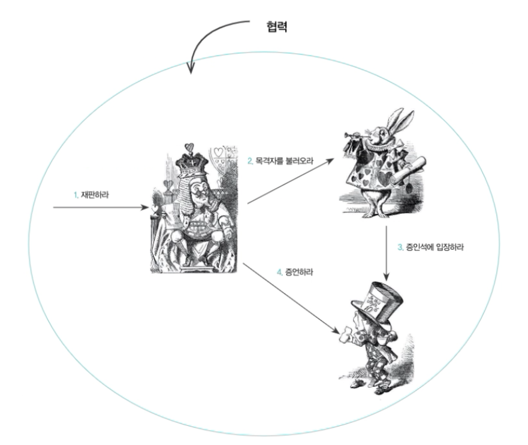

# 04. 역할, 책임, 협력

객체의 세계에서도 협력이라는 문맥이 객체의 행동 방식을 결정합니다.
객체지향 설계 중 실수는 협력이라는 문맥을 고려하지 않은 채 객체가 가져야할 상태와 행동부터 고민하기 시작하는 것입니다.

중요한 것은 개별 객체가 아니라 객체들 사이에 이뤄지는 협력입니다.
객체지향 설계의 전체적인 품질을 결정하는 것은 개별 객체의 품질이 아니라 여러 객체들이 모여 이뤄내는 협력의 품질입니다.

## 협력

### 요청하고 응답하며 협력하는 사람들

### 재판 속의 협력

재판장에서 사람들이 어떤 방식으로 협력하고 있는지 살펴봅시다.
많은 요청과 응답하는 과정 속에서 이뤄집니다.

어떤 등장인물들이 특정한 요청을 받아들일 수 있는 이유는 그 요청에 대해 적절한 방식으로 응답하는 데 필요한 지식과 행동 방식을 가지고 있기 때문입니다.
그리고 요청과 응답은 협력에 참여하는 객체가 수행할 책임을 정의합니다.

## 책임
