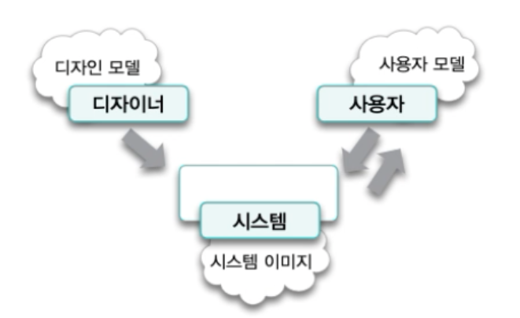

# 06. 객체 지도

지도는 길을 찾는 데 필요한 구체적인 기능이 아니라 길을 찾을 수 있는 **구조**를 제공합니다.

길을 묻는 방법은 출발지에서 목적지까지의 현재 요구만을 만족시킬 수 있는데 비해 지도는 현재의 목적 뿐만 아니라 다양한 목적을 위해 재사용될 수 있습니다.

지도가 범용적인 이유는 지도를 사용하려는 사람들이 원하는 기능에 비해 지도에 표시된 구조가 더 안정적이기 때문입니다.
지도는 여러 요구사항들이 계속 변함에도 이를 수용할 수 있는데 그 이유는 상대적으로 잘 변하지 않는 안정적인 지형 정보를 기반으로 하고 있기 때문입니다.

지도를 예시로 든 핵심은, 기능이 아니라 구조를 기반으로 모델을 구축하는 편이 좀 더 범용적이기 이해하기 쉬우며 안정적이라는 것입니다.

이번 장에서는 기능이 아니라 구조를 바탕으로 시스템을 분할하는 객체지향의 측면에 관해 설명합니다.
자주 변경되는 기능이 아니라 안정적인 구조를 기반으로 시스템을 분할하는 객체지향적인 접근법은 역할, 책임, 협력을 기반으로 시스템의 기능을 구현하는 책임-주도 설계의 본질을 이해하는데 도움이 됩니다.

## 기능 설계 대 구조 설계

소프트웨어 제품의 설계에는 두 가지 측면이 존재합니다.

* 기능 측면의 설계 : 제품이 사용자를 위해 무엇을 할 수 있는지에 초점
* 구조 측면의 설계 : 제품의 형태가 어떠해야 하는지에 초점

훌륭한 기능이 훌륭한 소프트웨어를 만드는 충분조건이라고 한다면, 훌륭한 구조는 훌륭한 소프트웨어를 만들기 위한 필요조건입니다.

요구사항이 계속 변하는 미래에 대비하는 가장 좋은 방법은 변경을 예측하는 것이 아니라 변경을 수용할 수 있는 선택의 여지를 설계에 마련해 놓는 것입니다.
설계를 하는 목적은 나중에 설계하는 것을 허용하는 것이며, 설계의 일차적인 목표는 변경에 소요되는 비용을 낮추는 것입니다.

전통적인 기능 분해는 자주 변경되는 기능을 중심으로 설계한 후 구조가 기능을 따르게 합니다.
이 때문에 전통적인 기능 분해 방법은 변경에 취약합니다.

이에 비해 객체지향 접근방법은 자주 변경되지 않는 안정적인 객체 구조를 바탕으로 시스템 기능을 객체 간의 책임으로 분배합니다. 
객체지향은 객체의 구조에 집중하고 기능이 객체의 구조를 따르게 만듭니다.
시스템 기능은 더 작은 책임으로 분할되고 적절한 객체에게 분배되기 때문에 기능이 변경되더라도 객체 간의 구조는 그대로 유지됩니다.

## 두 가지 재료: 기능과 구조

객체지향 세계를 위해서는 사용자에게 제공할 '기능'과 기능을 담을 안정적인 '구조'가 필요합니다.

일반적으로 기능을 수직하고 표현하기 위해서 **유스케이스 모델링** 을 사용하고, 구조를 수집하고 표현하기 위해 **도메인 모델링 ** 을 사용합니다.

## 안정적인 재료: 구조

### 도메인 모델

사용자가 프로그램을 사용하는 대상 분야를 **도메인** 이라고 합니다.

모델은 대상을 단순화해서 표현한 것입니다
모델을 사용하면 현재의 문제와 관련된 측면은 추상화하고 그 밖의 관련 없는 세부 사항에 대해서는 무시할 수 있습니다.
모델은 복잡성을 관리하기 위해 사용하는 기본적인 도구입니다.

도메인 모델은 단순히 다이어그램이 아니라 이해관계자들이 바라보는 멘탈 모델입니다.
멘탈 모델이란 사람들이 자기 자신, 다른 사람, 환경, 자신이 상호작용하는 사물들에 대해 갖는 모형입니다.

멘탈 모델을 아래와 같이 세 가지로 구분할 수 있습니다.

* 사용자 모델 : 사용자가 제품에 대해 가지고 있는 개념들의 모습
* 디자인 모델 : 설계자가 마음 속에 갖고 있는 시스템에 대한 개념화
* 시스템 이미지 : 최종 제품

사용자의 모델과 디자인 모델이 동일하다면 이상적이겠지만 사용자와 설계자는 직접적으로 상호작용할 수 없으며 단지 최종 제품인 시스템 그 자체를 통해서만 의사소통할 수 있습니다.

### 도메인의 모습을 담을 수 있는 객체지향

객체지향을 이용하면 도메인에 대한 사용자 모델, 디자인 모델, 시스템 이미지 모두가 유사한 모습을 유지하도록 만드는 것이 가능합니다.
객체지향의 이러한 특징을 **연결완전성** 또는 **표현적 차이**라고 합니다.

### 표현적 차이

소프트웨어 객체는 현실 객체에 대한 추상화가 은유입니다.
소프트웨어 객체는 현실 객체를 모방한 것이 아니라 은유를 기반으로 재창조한 것입니다.

비록 소프트웨어 객체가 현실 객체를 왜곡한다고 하더라도 소프트웨어 객체는 현실 객체의 특성을 토대로 구축합니다.
이처럼 둘의 의미적 거리를 가리켜 **표현적 차이**라고 합니다.

코드는 도메인 모델의 개념과 관계를 은유해야 합니다.

### 불안정한 기능을 담는 안정적인 도메인 모델

도메인 모델이 제공하는 구조가 상대적으로 안정합니다.

도메인 모델의 핵심은 사용자가 도메인을 바라보는 관점을 반영해 소프트웨어를 설계하고 구현하는 것입니다.
사용자들은 도메인을 구성하는 중요한 개념과 개념 간의 관계를 가장 잘 알고 있는 사람들이기 때문에 이들의 관점을 반영하는 것이 중요합니다.

사용자 모델에 포함된 개념과 규칙은 비교적 변경될 확률이 적기 때문에 사용자 모델을 기반으로 설계와 코드를 만들면 변경에 쉽게 대처할 수 있을 가능성이 커집니다.

아래 모델은 정기예금 상품에 대한 모델입니다.

## 불안정한 재료: 기능

### 유즈케이스

훌륭한 기능적 요구사항을 얻기 위해서는 목표를 가진 사용자와 사용자의 목표를 만족시키기 위해 일련의 절차를 수행하는 시스템 간의 '상호작용' 관점에서 시스템을 바라봐야 합니다.

사용자의 목표를 달성하기 위해 사용자와 시스템 간에 이뤄지는 상호작용의 흐름을 텍스트로 정리한 것을 **유스케이스**라고 합니다.

